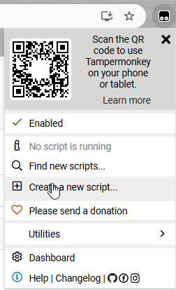

# Mike Tampermonkey scripts

Welcome to my repo of (eventually) various scripts for the wonderful extension [Tampermonkey](https://www.tampermonkey.net/).

## Browser support

All of my frontend dev experience is on hobby projects, so I have little formal experience working with multiple browsers, developing cross-browser (and handling old browsers), etc. I test my scripts using the latest version of Chrome, and when I think of it, Firefox and Edge. I welcome contributions that add better browser support.

## Repo structure

```
/
|-- scripts -> source code for different scripts / sites
|-- dist    -> built / bundled scripts that can be referenced directly in a TM userscript, as well as a userscript file that you can add to your Tampermonkey extension.
```

These are built using typescript and bundled into a single file using esbuild. Is this overkill? Absolutely. But you haven't lived until you've developed Tampermonkey scripts in typescript with auto-reloading. I also understand that this obfuscates the built script and may cause concerns about blindly importing it into your browser. That is why I have also provided file checksums *\<coming soon\>* and build instructions below, to allow you to build from source yourself or just verify that the distribution file matches.

## Installing a script

1. Browse to the `dist/<script>` directory for the script you want. 
2. In your Tampermonkey extension, add a new script.



3. Copy the contents of `dist/<script>/script.user.js` into the editor. This header-only script will reference the latest version from the `dist` directory. See below to learn how to pin a version *\<coming soon\>*

## Local setup

You are welcome to edit a script or build / verify it yourself. The repo already contains the distributable user scripts. However, you can build and overwrite them locally.

### Pre-reqs

- node v23.1.0 (others probably work) - I use `nvm` for these examples.
- pnpm

### Commands

```bash
git clone https://github.com/mikeurbanski1/tampermonkey-scripts.git
cd tampermonkey-scripts
nvm use # if you use nvm, otherwise skip
pnpm i
cd scripts/procyclingstats-spoiler-free # choose your script
pnpm package # creates the build output (from tsc) and recreates the dist directory contents
```

### Using the local script in Tampermonkey

Tampermonkey can load scripts from your local hard drive. First, you need to give the extension permissions to do so.

1. In Chrome, navigate to *Extensions* -> *Manage Extensions*
2. Find Tampermonkey, and click *Details*
3. Enable *Allow access to file URLs*

To run your local script:

1. Open the script you wish to run locally in the Tampermonkey editor
2. Change the `@require` line to: `file://<path to your local dist script>`
   1. Note: for WSL, the path will look something like this: `file://\\wsl.localhost\Ubuntu\<absolute path within WSL env>`

### Live updates

When you run the script from your hard drive, you can also automatically repackage it whenhever you update the `src` files, so that the updated script loads the next time you refresh your browser. To do so, use the `pnpm watch` command.

### Notes

- If you want to change the Tampermonkey script headers for any reason, edit the `userscript-contents.txt` file and run `pnpm package` (or just update this directly, since this script does not actually have any automation associated with it other than copying it to the `dist` directory).

