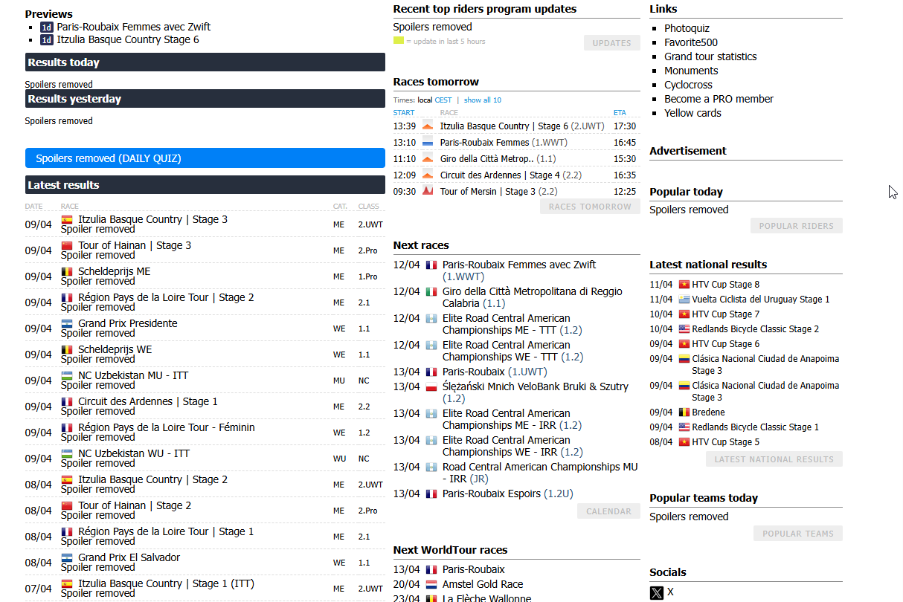
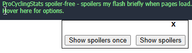
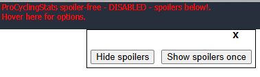

# Spoiler-free* browsing on www.procyclingstats.com\

This script will remove many, or maybe most, or perhaps eventually all spoilers on procyclingstats.com. The goal is to make it easy to look up relevant information, as as other race results, team result, rider historical stats, etc. while watching races on a delay. You know, the thing that spoilers ruin.

**Note: spoilers will flash briefly when pages load! Avert your eyes.**

Currently I am taking a very crude hammer to the pages, attempting to remove as much as possible as quickly as possible. This is not usually hard, just repetitive.

## Spoiler-free pages

- Homepage (recent results, articles, in-progress live results, rider popularity (indrect spoiler?), daily quiz)
- Race pages
  - Race overview (shows summary data about past winners)
  - Race results (duh)
    - Stage race results by stage and overall
    - One-day race results
    - DNFs on race startlist
- Rider overview (recent results, top result summary, points)

I will add more, but this covers the main flows, I think.

## Features

### Show / hide spoilers

Spoilers can be hidden, or temporarily or permanently shown using the menu at the top right:

When you click any of these buttons, the page will refresh and the setting will be applied immediately.

- Hide spoilers -> runs the script on every page load to remove spoilers
- Show spoilers once -> do not hide spoilers on this page refresh, but hide them on all future page loads (useful to see the results of one race, for example)
- Show spoilers -> do not hide spoilers

## Planned features

- A spoiler date, where only spoilers after that date will be hidden (as much as is possible if date context exists on the page / element)
- Line-item spoilers that you can selectively show or hide, without affecting the whole page (e.g., on a big table of race results from this year's races, show the winner of one race without seeing the winner of others)